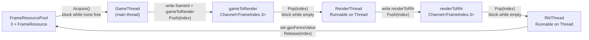
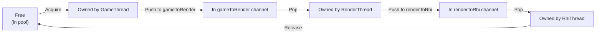

# Thread Model

> [!info]
> This graph reflects the actual implementation: two channels plus a `FrameResourcePool` return
> path (no third queue). Mermaid output is an inspection aid, not a scheduler design verdict.

## Ownership and Data-Flow Loop

A `FrameIndex` travels the loop once per frame. The channel carries only the index; the frame's
data (`RenderFrame gameToRender`, `RenderWorkBatch renderToRhi`, `frameId`, `gpuFenceValue`) lives in the `FrameResource`
that the index points into.

## Who Owns a FrameResource at Each Moment

Exactly one owner exists at any moment: either the pool (free) or one of the three stages. This
single-owner invariant is what makes each stage's write to the `FrameResource` safe without locks.

## Scheduling Facts

| Thread | Runs on | Idle behavior | Stop path |
| --- | --- | --- | --- |
| GameThread | the process main thread | blocks in `FrameResourcePool::Acquire()` | stops producing, then requests stops downstream |
| RenderThread | a `Thread` running the `RenderThread` runnable | blocks in `gameToRender.Pop()` | `Stop()` calls `gameToRender.Close()` |
| RhiThread | a `Thread` running the `RhiThread` runnable | blocks in `renderToRhi.Pop()` | `Stop()` calls `renderToRhi.Close()` |

- Scheduling is **fixed threads + blocking channels**, not a task graph. No thread polls or spins.
- Back-pressure comes from the pool: `GameThread` produces at most three frames ahead of the GPU.
- Shutdown is explicit and upstream-first: stop `RenderThread`, then `RhiThread`. Each `Close()`
  wakes the blocked `Pop()`, which drains remaining frames, then returns `std::nullopt` and exits.
